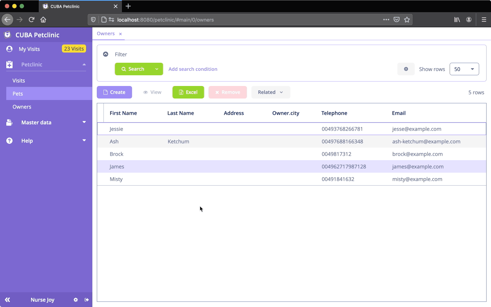

# CUBA Petclinic 

<p align="center">
  
</p>


## Example: Dependent Lookup Fields

This Example extends the CUBA Petclinic with dependent lookup components in order to select a hierachical owner address.




In the [address-edit.xml](modules/web/src/com/haulmont/sample/petclinic/web/screens/owner/address/address-edit.xml) the dependencies between the lookup fields are connected via the [dataLoadCoordinator](https://doc.cuba-platform.com/manual-latest/gui_DataLoadCoordinator.html) component:

```xml
<data>
    <!-- ... -->
    <collection id="countriesDc" class="com.haulmont.sample.petclinic.entity.owner.address.Country"
      view="_minimal">
      <loader id="countriesDl">
        <query>
          <![CDATA[select e from petclinic_Country e]]>
        </query>
      </loader>
    </collection>
    <collection id="statesDc" class="com.haulmont.sample.petclinic.entity.owner.address.State"
      view="_minimal">
      <loader id="statesDl">
        <query>
          <![CDATA[select e from petclinic_State e where e.country = :container_countriesDc]]>
        </query>
      </loader>
    </collection>
    <collection id="citiesDc" class="com.haulmont.sample.petclinic.entity.owner.address.City"
      view="_minimal">
      <loader id="citiesDl">
        <query>
          <![CDATA[select e from petclinic_City e where e.state = :container_statesDc]]>
        </query>
      </loader>
    </collection>
    <collection id="streetsDc" class="com.haulmont.sample.petclinic.entity.owner.address.Street"
      view="_minimal">
      <loader id="streetsDl">
        <query>
          <![CDATA[select e from petclinic_Street e where e.city = :container_citiesDc]]>
        </query>
      </loader>
    </collection>
  </data>

  <facets>
    <dataLoadCoordinator auto="true"/>
  </facets>
```


The dynamic removal of the dependent values once a higher level entry changes is done programmatically in the AddressEdit controller like this:

```java
public class AddressEdit extends StandardEditor<Address> {

    @Inject
    protected LookupField<Street> streetField;
    @Inject
    protected LookupField<City> cityField;
    @Inject
    protected LookupField<State> stateField;

    @Subscribe("cityField")
    protected void onCityFieldValueChange(ValueChangeEvent<City> event) {
        clearField(streetField, event);
    }

    @Subscribe("stateField")
    protected void onStateFieldValueChange(ValueChangeEvent<State> event) {
        clearField(cityField, event);
    }

    @Subscribe("countryField")
    protected void onCountryFieldValueChange(ValueChangeEvent<Country> event) {
        clearField(stateField, event);
    }

    private void clearField(LookupField<? extends Entity> field, ValueChangeEvent<? extends Entity> event) {
        if (event.getPrevValue() != event.getValue()) {
            field.setValue(null);
        }
    }
}
```